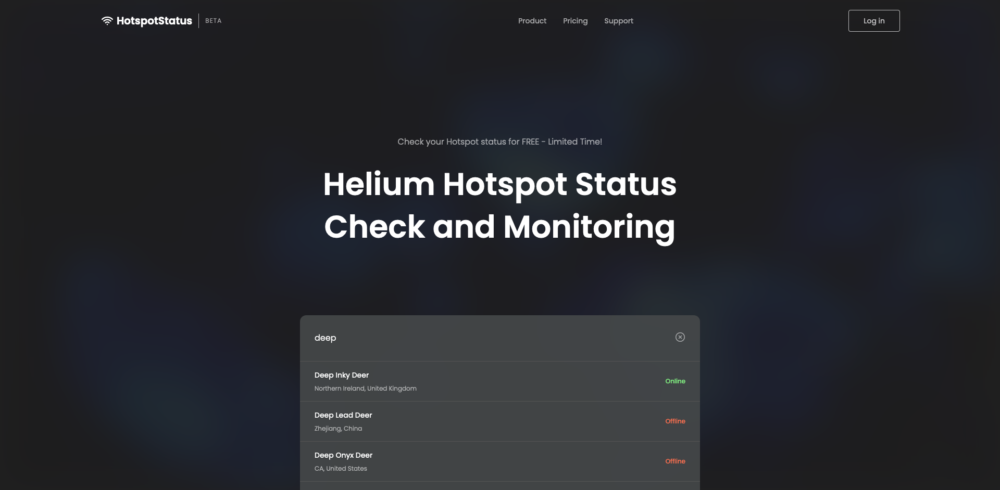

`2022 Series`
# HotspotStatus - Helium Hotspot Status Check and Monitoring
Hotspot Status is a React app that uses the Helium API to view your Helium hotspot and check via the NodeJS API if the hotspot is online or offline.

### Development
* React
* TailwindCSS
* HTML5
* CSS3

---

### Other Links
* Personal website: [https://xsuve.com/](https://xsuve.com/)
* Dribbble: [https://dribbble.com/xsuve/](https://dribbble.com/xsuve/)
* Twitter: [https://twitter.com/xsuve_/](https://twitter.com/xsuve_/)
* Instagram: [https://instagram.com/xsuvecom/](https://instagram.com/xsuvecom/)
